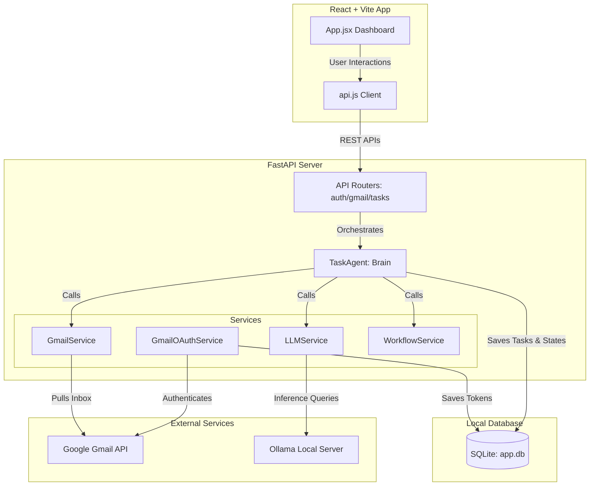

# Auto‑Task‑Generator: Project Documentation

This documentation describes the architecture, tech stack, LLM services, and website flow of the **Auto-Task-Generator** project. The project is an autonomous AI agent system designed to fetch emails from Gmail, parse them to extract actionable tasks, reason about those tasks to construct multi-step workflow plans, and execute them.

---

## 🏗️ System Architecture

The following Mermaid diagram shows the high-level architecture and how the components interact:



---

## 🛠️ Web Stack

The application is structured as a decoupled web application with a FastAPI Python backend and a React Vite frontend:

### 1. Backend Stack
* **Framework:** **FastAPI** (Python 3.11/3.12)
  * High-performance, asynchronous routing.
  * Auto-generated Swagger documentation available at `/docs` and ReDoc at `/redoc`.
* **Server:** **Uvicorn** (running on port `8000`)
* **ORM:** **SQLAlchemy**
* **Database:** **SQLite** (`app.db` located in the backend root directory)
  * Automatically creates schema tables on application startup.
* **Configuration:** **Pydantic Settings** (`BaseSettings`)
  * Loads settings and configurations from `.env` environment files dynamically.

### 2. Frontend Stack
* **Framework:** **React 19**
* **Build Tool:** **Vite** (running dev server on port `5173`)
* **Styling:** **Vanilla CSS**
  * Typography: Google Fonts (Inter)
  * Responsive Layout: CSS Flexbox and CSS Grid
  * Design Pattern: Bento-Grid style cards, clean dark accents, smooth transitions, and distinct status color codes.
* **HTTP Client:** Native browser `fetch` API wrapped in a clean, modular class (`api.js`).

---

## 🤖 Large Language Models (LLMs) & Models

The project leverages local Large Language Models to run task extraction and planning fully offline, ensuring complete data privacy and no API costs.

* **LLM Provider:** **Ollama** (running locally on port `11434`)
* **Default Model:** `llama3.2:1b` (mistral or llama2 can also be configured)
* **Model Configuration Details:**
  * **Temperature:** `0.7` (balances creative planning steps with rule-adherence)
  * **Max Output Limit:** `num_predict=800` (caps responses to keep local inference speed high)
  * **Format:** JSON Mode (ensures Ollama replies exclusively in parseable JSON objects)

### LLM Prompt Actions:
1. **Task Extraction:** Evaluates email subjects and bodies to return Pydantic-compatible JSON objects detailing task titles, descriptions, priority levels, due dates, and tags.
2. **Task Reasoning & Planning:** Takes an extracted task and generates workflow steps, listing tools, requirements, and risks.
3. **Execution Summarization:** Summarizes step outcomes to output task status, key points, and next steps.

---

## 💾 Database Schema

The SQLite database (`app.db`) contains two primary tables:

### 1. `tasks` (Task Store)
Holds manually created or AI-extracted tasks.
* `id` (String, Primary Key): Unique identifier (e.g., `task_f89a8c`).
* `title` (String): Task title.
* `description` (Text): Detailed task description.
* `priority` (String): Urgency (low, medium, high, urgent).
* `status` (String): Execution state (pending, completed, failed).
* `due_date` (DateTime, Nullable): Completion deadline.
* `assigned_to` (String, Nullable): Assignee email address.
* `tags_json` (Text): JSON string list representing categories (e.g. `["work", "gmail"]`).
* `source_email` (String): Email subject from which the task was parsed.
* `extracted_from` (Text): The raw email snippet parsed by the LLM.
* `created_at` / `updated_at` / `completed_at` (DateTime).

### 2. `gmail_tokens` (OAuth Store)
Stores verified credentials for Google Gmail access.
* `email` (String, Primary Key): User's Google email address.
* `access_token` (Text)
* `refresh_token` (Text)
* `token_uri` (Text)
* `client_id` / `client_secret` (Text)
* `scopes` (Text): JSON array of scopes.
* `expiry` (Text): Expiration timestamp.

---

## 🔄 Core Website & Authentication Flow

### 1. Initial State & CORS Preflight
* When the user opens the frontend (`http://localhost:5173/`), the dashboard requests the current tasks list (`GET /api/tasks/?limit=50`).
* If the user triggers an email fetch without credentials, the backend attempts to load credentials and refresh them. If they are expired or missing, it returns `401 Unauthorized`.

```
[Frontend Dashboard] --(GET /api/gmail/recent-plans)--> [Backend API]
                                                               |
                                                   [Load & Refresh Tokens]
                                                               |
                                                   (Expired/Missing Refresh Token)
                                                               |
[Show Connection Banner] <---(HTTP 401 Unauthorized)-----------+
```

### 2. Authentication Flow
1. **Initiate Login:** The user clicks **"Connect Google Account"** which redirects their browser to `http://localhost:8000/auth/google/login`.
2. **Google OAuth Authorization:**
   * Backend generates a Google OAuth login URL with scopes (`openid`, `userinfo.email`, `gmail.readonly`) and redirects the user.
   * User logs into Google, reviews permissions, and clicks **Allow** (bypassing the dev warning via **Advanced** if needed).
3. **Token Exchange & Storage:**
   * Google redirects back to `http://localhost:8000/auth/google/callback?code=AUTH_CODE`.
   * The backend takes the authorization code, exchanges it with Google for permanent credentials (including the `refresh_token`), requests the user's email, and saves these credentials in the SQLite database under the user's email.
   * Returns a JSON success message.

### 3. Task Extraction Flow
1. User navigates back to the Dashboard and clicks **"Extract Now"**.
2. Frontend calls `GET /api/gmail/recent-plans?limit=10&mode=raw`.
3. Backend fetches the latest 10 messages from Gmail, cleans their bodies, filters out marketing/promotional newsletters, and returns them to the frontend.
4. For each relevant email, the frontend asynchronously triggers task extraction by calling `POST /api/tasks/extract`.
5. Backend uses the local LLM (`llama3.2:1b`) to extract tasks, saves them to the SQLite database, and returns them.
6. The dashboard list and charts automatically update to reflect the newly saved tasks.

---

## 🛡️ Exception & Error Handling

* **Token Expiry (401 Handler):** If the backend encounters a `google.auth.exceptions.RefreshError` when initializing the Gmail connection, it intercepts it and returns an `HTTP 401` error. This prompts the React app to display the authorization UI instead of crashing with a generic 500 error.
* **CORS Middleware:** Added to allow cross-origin requests from `http://localhost:5173` to `http://localhost:8000`.
